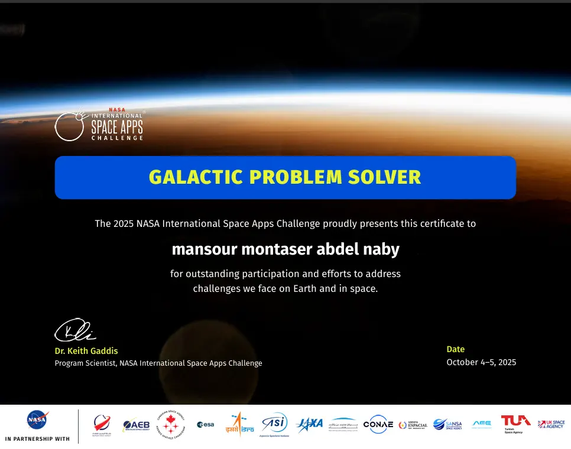
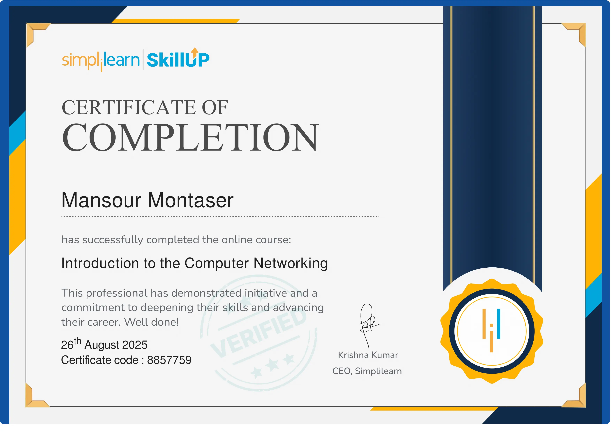
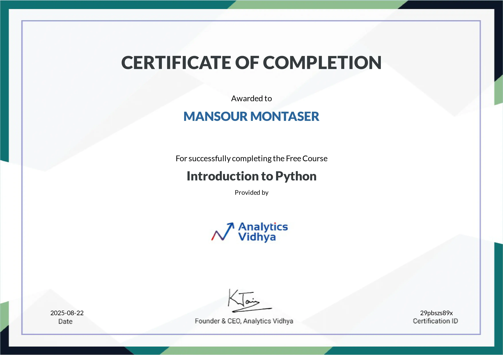
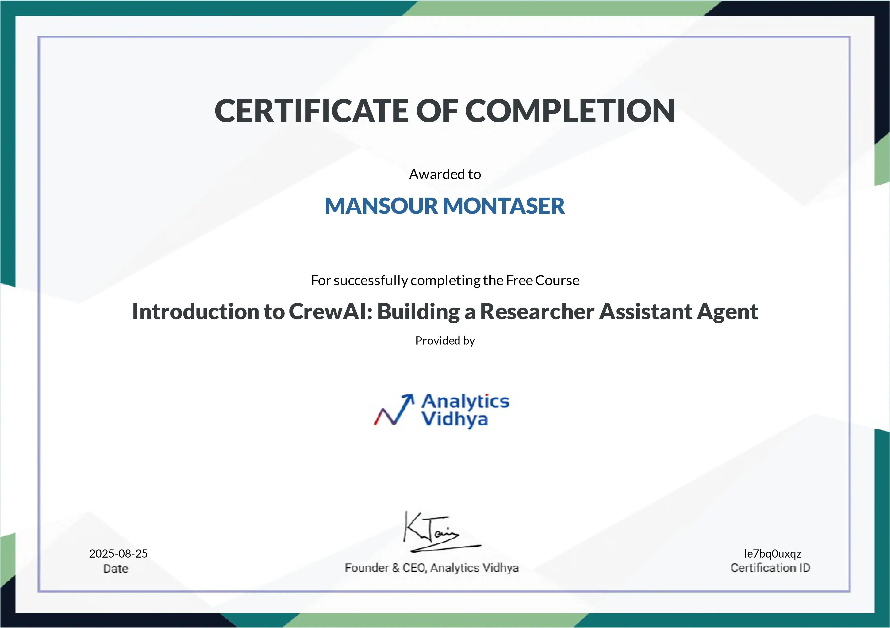

 

  

<h1 style="font-size:42px; margin: 0; color:#ffffff;">
  FRONT-END DEVELOPER
</h1>

  Senior Graphic Designer • Founder of CIAIF Academy

  
  
  
  

---

## About Me

I’m **Mansour Montaser**, a **Front-End Developer**, **Senior Graphic Designer**, and **Founder of CIAIF Academy**.

I build modern, responsive, and visually refined web experiences with a strong focus on clean structure, smooth interaction, and premium presentation.

I also create educational content and help beginners understand web development in a simple, practical way.

---

## What I Do

- Modern portfolio websites
- Landing pages and business websites
- Interactive front-end interfaces
- Graphic design and visual identity
- Educational and academy-based digital content

---

## Tech Stack

---

## Featured Projects

<table>
  <tr>
    <td width="50%" align="center" valign="top">
      
        
      <strong>Modern Portfolio Website</strong>
       
      Responsive UI, smooth interaction, and strong visual hierarchy.
    </td>
    <td width="50%" align="center" valign="top">
      
        
      <strong>Creative Web Experience</strong>
       
      A polished layout focused on clarity, branding, and premium feel.
    </td>
  </tr>
</table>

---

## Certifications

<table>
  <tr>
    <td align="center" width="33%">
      
        
      <b>NASA Space Apps Challenge 2025</b> 
      Innovation & Teamwork
    </td>
    <td align="center" width="33%">
      
        
      <b>Public Relations</b> 
      Communication & Strategy
    </td>
    <td align="center" width="33%">
      
        
      <b>Computer Networking</b> 
      Systems & Foundations
    </td>
  </tr>
  <tr>
    <td align="center" width="33%">
      
        
      <b>Introduction to Python</b> 
      Programming & Logic
    </td>
    <td align="center" width="33%">
      
        
      <b>Introduction to CrewAI</b> 
      AI Agents & Research
    </td>
    <td align="center" width="33%">
      
        
      <b>ICDL Certificate</b> 
      Digital Competence
    </td>
  </tr>
</table>

---

## GitHub Stats

---

## Current Focus

- Premium front-end architecture
- Smooth motion and interaction design
- Strong personal branding
- High-quality portfolio projects
- Educational content and mentoring

---

## Contact Me

  

---

